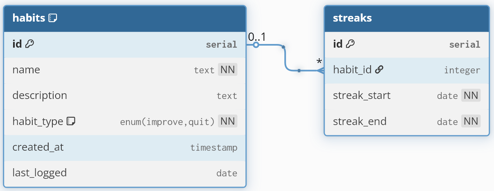

# Design doc

### Database design
Streaker uses a simple SQLite database to store user habits and their streaks. The database schema is designed to be efficient and easy to query. Another reason to choose sqlite is that it is perfect for cli apps like this, as all its data lives in a single file, and it can be placed in user specific directories (`~`) and can support multiple users.

for the schema, all the habit logs live under the `streaks` table with 2 columns `streak_start` and `streak_end` as we require only those 2 to calculate a streak. As we will see further, we can leverage this same structure for both 'improvement' and 'quitting' habits



For the improvement habits we store the occurances of those habits in the `streaks` table in form of a range `streak_start` to `streak_end`, gaps in which tell us if the user missed few days.
For quitting habits however, we store the "good days" where user did not perform the habit, and the gaps in this table will tell us about slip-ups.

### Streak calculation

#### Current streak (running streak)
- For improvement habits, we can get the last entered streak from database using
	```sql
	SELECT id, habit_id, streak_start, streak_end
	FROM streaks
	WHERE habit_id = ?
	ORDER BY streak_end DESC
	LIMIT 1;
	```
	if the `streak_end` is yesterday, we simply update it to today's date., else we make a new entry with both `streak_end` and `streak_start` set to today.
- For quitting habits we have to infer the "good days" or the streak based on last logged slipup. So we can simply do `today - latest_streak_end - 1` as the current streak. Notice `-1` as its inclusive of today, and we did not log a slip-up today, nor the day has passed yet to mark it as "clean".

#### Max streak
- For improvement Habits we simply query the db for `MAX(1 + streak_end - streak_start)` as improvement habits are inclusive of both start and end dates
- For quitting habits we get rid of the `1+` as the starting end is not inclusive.


